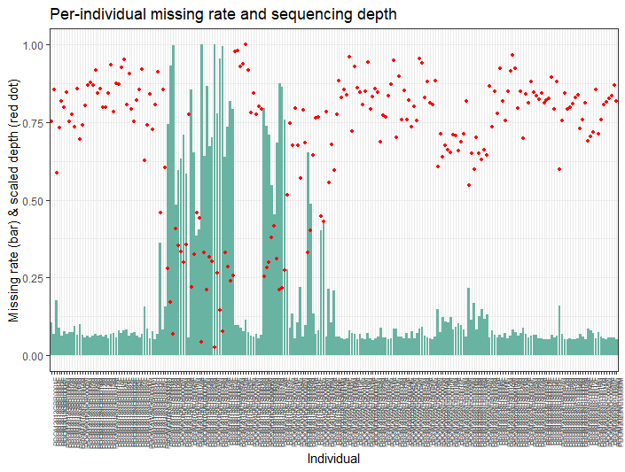
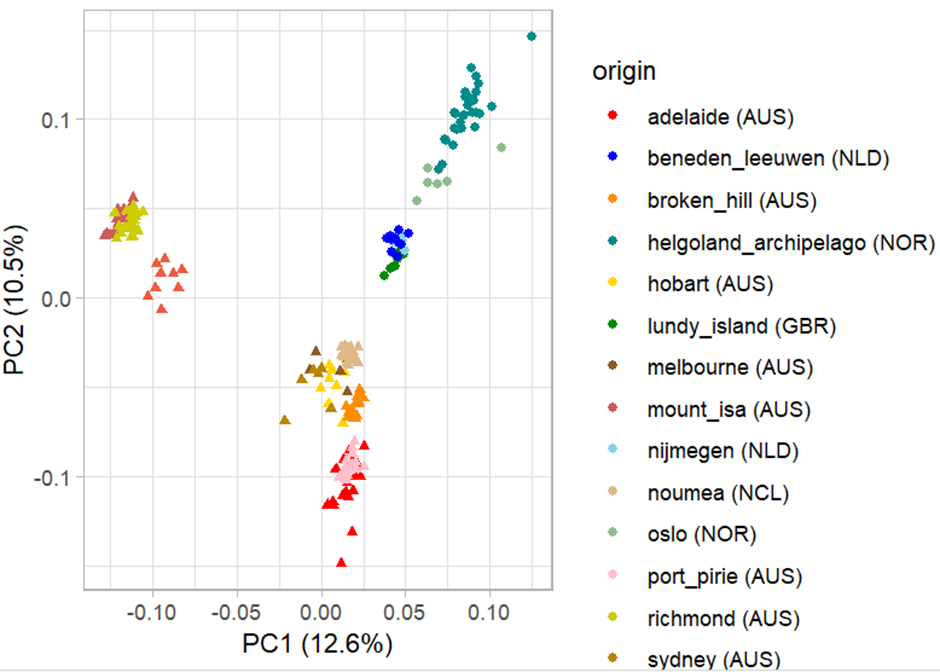
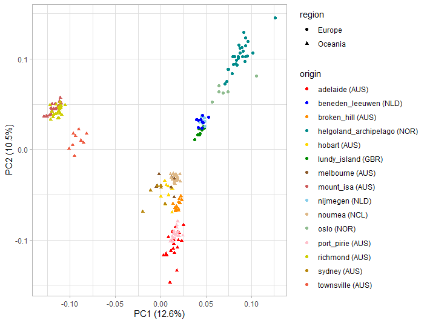
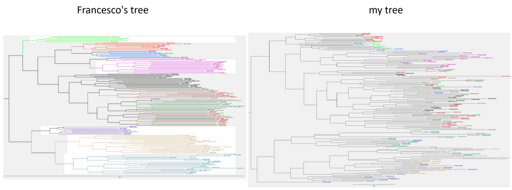
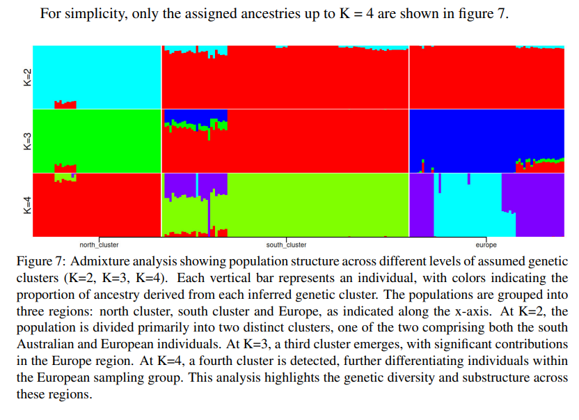
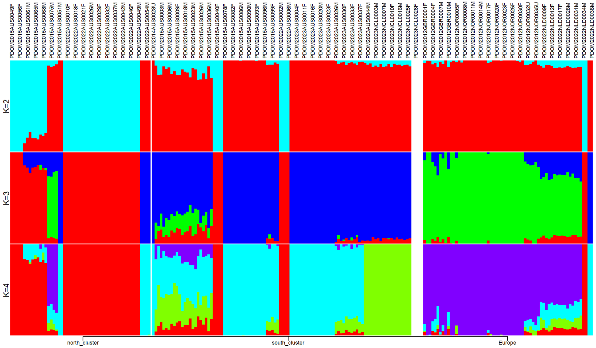
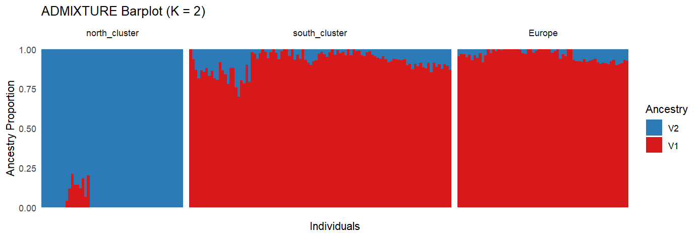
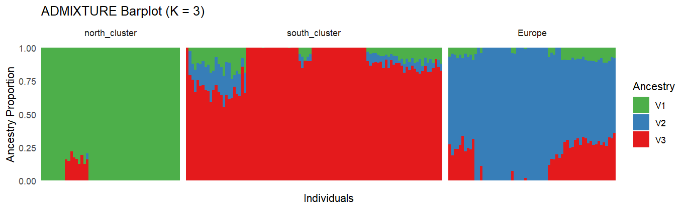

# reproduce_F
This is my workflow to reproduce Francesco's analysis.

## Mean depth and missing rates
My analysis used ```wholegenome_sparrows_variants_norm.vcf.gz```, which is generated by Francesco.
It's a variant only .vcf file of all the concatenated chromosomes (incl. sex chromosome Z) and scaffolds. 
It was normalized by the command ```bcftools norm```.

Missing rates for each individual were extracted with:

```
vcftools --gzvcf /cluster/work/users/ysun/HouseAusLead_filteredvcf/wholegenome_sparrows_variants_norm.vcf.gz \
  --missing-indv
```

which produced ```out.imiss```.

Mean depths for each individual were extracted with:

```
vcftools --gzvcf /cluster/work/users/ysun/HouseAusLead_filteredvcf/wholegenome_sparrows_variants_norm.vcf.gz \
  --depth --out depth.out
```

which produced ```depth.out.idepth```.

```out.imiss``` and ```depth.out.idepth``` were then downloaded and processed in RStudio using the R script ```missing_rate_plot.R```. 



## PCA
Work directory:

```
cd /cluster/work/users/ysun/PCA/
```

Load plink module for analysis:

```
module load PLINK/1.9b_6.13-x86_64
```

#### Linkage pruning
```
VCF=/cluster/work/users/ysun/HouseAusLead_filteredvcf/wholegenome_sparrows_variants_norm.vcf.gz

plink --vcf $VCF \
  --allow-extra-chr \
  --chr-set 30 \
  --double-id \
  --indep-pairwise 50 10 0.1 \
  --mind 0.99 \
  --out sparrows_ys \
  --set-missing-var-ids @:#
```

This produced ```sparrows_ys.prune.in``` and ```sparrows_ys.prune.out```.

#### Perform PCA
```
plink --vcf $VCF \
  --double-id \
  --allow-extra-chr \
  --set-missing-var-ids @:# \
  --extract sparrows_ys.prune.in \
  --make-bed \
  --pca \
  --out sparrows_ys \
  --chr-set 30 \
  --mind 0.99
```

This produced ```sparrows_ys.bed```, ```sparrows_ys.bim```, ```sparrows_ys.fam```, ```sparrows_ys.eigenval``` and ```sparrows_ys.eigenvec```.
```sparrows_ys.eigenval``` and ```sparrows_ys.eigenvec``` were then processed locally in RStudio using the script ```PCAafterPLINK_ys.R``` 
(metadata ```metadata.csv``` is needed). 

The eigenvalues are still different from Francesco's (I don't know why, maybe normal stochasticity?), but the final plot looks completely identical:

Francesco's:

My:


## Population tree
I followed Francesco's instructions in his email: 
"I first filtered the .vcf obtained in the first step file to include only the samples I was interested in, 
unzipped it and randomly subsampled it to include 1 million snps, zipped it again and indexed it, 
removed invariant sites, converted it to .phyl with the custom python script I uploaded 
and finally ran iqtree2 -st DNA -m GTR+ASC –threads-max 4 -B 1000 -s <data>. 
I used vcftools for everything and the scripts you find in the dropbox for the last two steps. " by:

```
# Get a list of wanted sample names (only Australian and New Caledonian)
bcftools query -l gs_wholegenome_sparrows_variants_norm.vcf.gz | grep -E "AUS|NCL" > keep_AUS_NCL.txt

# Filter the whole genome vcf according to the list
vcftools --gzvcf gs_wholegenome_sparrows_variants_norm.vcf.gz \
  --keep keep_AUS_NCL.txt \
  --recode --recode-INFO-all \
  --out filtered_AUS_NCL
# After filtering, kept 155 out of 219 Individuals.

# Randomly sample 1M SNPs from the generated vcf
grep -v "^#" filtered_AUS_NCL.recode.vcf | shuf -n 1000000 | sort -k1,1 -k2,2n > snp1M.body

# Add header
grep "^#" filtered_AUS_NCL.recode.vcf > header.txt
cat header.txt snp1M.body > snp1M.vcf

# Zip and index
bgzip snp1M.vcf
tabix -p vcf snp1M.vcf.gz

# Remove invariant sites
vcftools --gzvcf snp1M.vcf.gz \
  --remove-indels \
  --min-alleles 2 --max-alleles 2 \
  --recode --recode-INFO-all \
  --out snp1M_clean

# Apply the custom Python script
python vcf2phyl.py snp1M_clean.recode.vcf

# Run the iqtree code
iqtree2 -st DNA -m GTR+ASC --threads-max 4 -B 1000 -s snp1M_clean.recode.min4
```

Then I got this error:

```
ERROR: Invalid use of +ASC because of 159129 invariant sites in the alignment
```

But according to IQ-TREE's FAQ (https://iqtree.github.io/doc/Frequently-Asked-Questions), 
"Starting with IQ-TREE version 1.5.0, an output alignment file with suffix .varsites is written in such cases, which contain only variable sites from the input alignment. The .varsites alignment can then be used with the +ASC model."

So I ran:

```
iqtree2 -st DNA -m GTR+ASC --threads-max 4 -B 1000 -s snp1M_clean.recode.min4.phy.varsites.phy
```

Then I got another error:

```
WARNING: 38 sequences contain more than 50% gaps/ambiguity
****  TOTAL              32.27%  4 sequences failed composition chi2 test (p-value<5%; df=3)
WARNING: Sequence PDOM2015AUS0033F contains only gaps or missing data
ERROR: Some sequences (see above) are problematic, please check your alignment again
```

Sequence PDOM2015AUS0033F indeed contained only missing data. I checked her missing rate in ```snp1M_clean.recode.vcf```, 
and it was 0.999994, so after removing invariant sites, it was likely that only missing data were left for this sample.

So I manually removed this sample from ```snp1M_clean.recode.min4.phy.varsites.phy```, then the code ran successfully:

```
iqtree2 -st DNA -m GTR+ASC --threads-max 4 -B 1000 -s snp1M_clean.recode.min4.phy.varsites.copy.phy
```

```
Analysis results written to:
  IQ-TREE report:                snp1M_clean.recode.min4.phy.varsites.copy.phy.iqtree
  Maximum-likelihood tree:       snp1M_clean.recode.min4.phy.varsites.copy.phy.treefile
  Likelihood distances:          snp1M_clean.recode.min4.phy.varsites.copy.phy.mldist

Ultrafast bootstrap approximation results written to:
  Split support values:          snp1M_clean.recode.min4.phy.varsites.copy.phy.splits.nex
  Consensus tree:                snp1M_clean.recode.min4.phy.varsites.copy.phy.contree
  Screen log file:               snp1M_clean.recode.min4.phy.varsites.copy.phy.log
```

Then the treefile is downloaded to visualise in FigTree locally. 
However my tree is considerably different from Francesco's, although the overall conclusion is not affected.



## ADMIXTURE
I used the bim, fam and bed file from the PCA. Define input files and output directory:

```
FILE=/cluster/work/users/ysun/PCA/sparrows_ys
```

Load the ADMIXTURE module:

```
module load ADMIXTURE/1.3.0
```

I first renamed the chromosomes:

```
awk '{$1="0";print $0}' $FILE.bim > $FILE.bim.tmp
mv $FILE.bim.tmp $FILE.bim
```

Then loop from K=2 to K=7 (like Francesco did):

```
for i in {2..7}
do
 admixture --cv $FILE.bed $i > log${i}.out
done
```

This produced ```.out```, ```.P``` and ```.Q``` files for each K. 

Then, extract the number of K and the CV error for each corresponding K:

```
awk '/CV/ {print $3,$4}' *out | cut -c 4,7-20 > sparrows_ys.cv.error
```

I followed the code in the guideline to create a "species" list:

```
awk '{split($1,name,"."); print $1,name[2]}' $FILE.nosex > sparrows_ys.list
```

But in my case, it is population cluster instead of species and has to be assigned arbitrarily (three clusters based on the PCA result: 
"Europe", "north_cluster" and "south_cluster"). 
So I downloaded ```sparrows_ys.list``` and used R script ```plotADMIXTURE_ys.r``` to assign population cluster locally and got 
the output file ```sparrows_ys.info``` which can be used in the next step.

I downloaded all the P and Q files and ran this locally:

```
Rscript plotADMIXTURE.r -p sparrows_ys -i sparrows_ys.info -k 4 -l north_cluster,south_cluster,Europe
```

It still messed up like this:

Francesco's:

my:


However, it looked like it was still a plotting issue, so I wrote my own R script ```DiagnoseADMIXTURE.R``` just to diagnose. 
I only plotted K=2 and K=3, but they are more like Francesco's plot:




Some differences might be due to how the individuals were ordered.

I don't know why the data still messed up with Joana's R script...

## Detect selective sweep
For detecting selective sweep, I only used samples from one pair of sites: Broken Hill - Adelaide, to save time.

First, I used the R script ```GeneratePopInfo.R``` locally with ```metadata.csv``` to generate a list that only contained samples from Broken Hill 
and Adelaide.

The generated list ```pop.info``` was uploaded to HPC.

Then I subset the vcf.gz file to make one only contains Broken Hill and Adelaide individuals. First, create a list of sample names:

```
cut -f1 pop.info > sample_list.txt
```

Then extract the subset vcf:

```
# Load bcftools module
module load BCFtools/1.19-GCC-13.2.0

bcftools view -S sample_list.txt -Oz -o /cluster/work/users/ysun/BrokenHill_Adelaide/subset.vcf.gz $VCF
```

However, it gave me this error:

```
Error: subset called for sample that does not exist in header: "PDOM2015AUS0080F". Use "--force-samples" to ignore this error.
```

I ran following code to check which individuals were not in ```$VCF```:

```
bcftools query -l $VCF > vcf_samples.txt # Extract sample names from the vcf
comm -23 <(sort sample_list.txt) <(sort vcf_samples.txt) # Print individuals that are in the metadata but not in the vcf, which are:
PDOM2013AUS0029U
PDOM2013AUS0030U
PDOM2013AUS0031U
PDOM2013AUS0032U
PDOM2013AUS0033U
PDOM2013AUS0034U
PDOM2013AUS0035U
PDOM2013AUS0036U
PDOM2013AUS0037U
PDOM2014AUS0017U
PDOM2014AUS0023U
PDOM2014AUS0025U
PDOM2015AUS0080F
PDOM2015AUS0083M
PDOM2015AUS0088F
PDOM2015AUS0100F
PDOM2022AUS0003F
PDOM2023AUS0036F
PDOM2023AUS0038M
PDOM2023AUS0039M
PDOM2023AUS0041M
PDOM2023AUS0043M
PDOM2023AUS0045M
```

I don't know why they are not in the vcf, it may be about how the sequences were filtered? Anyway, I tried to get individuals that 
appeared in both the metadata and the vcf, by:

```
grep -Ff vcf_samples.txt pop.info > pop.valid.info # a filtered list with location info
cut -f1 pop.valid.info > sample.valid.txt # valid sample names
```

Then I ran this to subset the vcf:

```
bcftools view -S sample.valid.txt -Oz -o /cluster/work/users/ysun/BrokenHill_Adelaide/subset.vcf.gz $VCF

# And define it as future input data
VCFSUBSET=/cluster/work/users/ysun/BrokenHill_Adelaide/subset.vcf.gz

# Index the vcf
bcftools index $VCFSUBSET
```

#### F<sub>ST</sub>
The subset vcf is ready, then I'm going to calculate F<sub>ST</sub> for the two populations. This used the GitHub repository 
https://github.com/simonhmartin/genomics_general.

Load Python module:

```
module load Python/3.11.5-GCCcore-13.2.0
```

Run:

```
python parseVCF.py -i $VCFSUBSET | bgzip > subset.geno.gz
```

Calculate pi for each species and Fst and dxy for each pair of species all in one go. 

```
GENOGENE=/cluster/work/users/ysun/genomics_general

python $GENOGENE/popgenWindows.py -g subset.geno.gz -o subset.Fst.Dxy.pi.csv.gz \
   -f phased -w 20000 -m 10000 -s 10000 \
   -p adelaide -p broken_hill \
   --popsFile pop.valid.info \
   --verbose
```

In Francesco's thesis: "The calculation was done on sliding windows of 20000 kb, with a step size of 10000 kb". 
But I keep getting this:

```
...
Sorter received window 99797
Slice 99797 sent to writer
Writer received result 99797
Sorter received window 99798
Slice 99798 sent to writer
Writer received result 99798
Sorter received window 99799
Slice 99799 sent to writer
Writer received result 99799
Sorter received window 99800
Slice 99800 sent to writer
Writer received result 99800
Sorter received window 99801
Slice 99801 sent to writer
Writer received result 99801
Sorter received window 99802
Slice 99802 sent to writer
Writer received result 99802
Sorter received window 99803
Slice 99803 sent to writer
Writer received result 99803
99804 windows were tested.
0 results were written.

Done.
```