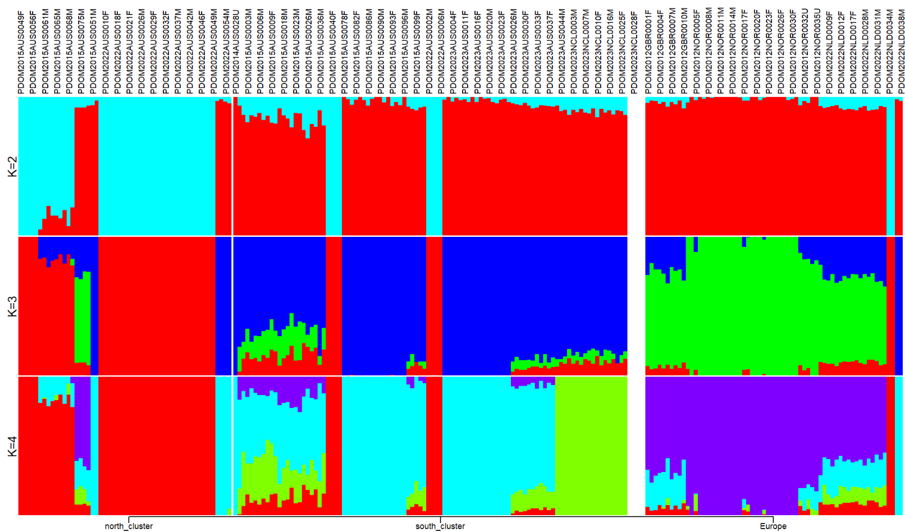

# reproduce_F
This is my workflow to reproduce Francesco's analysis.

## PCA
Load plink module for analysis:

```
module load PLINK/1.9b_6.13-x86_64
```

#### Linkage pruning
I started with ```VCF=wholegenome_sparrows_variants_norm.vcf.gz```. According to Francesco, it's a variant only .vcf file of all the concatenated chromosomes (incl. sex chromosome Z) and scaffolds. It was normalized by the command ```bcftools norm```.

```
plink --vcf $VCF \
  --double-id \
  --allow-extra-chr \
  --chr-set 28 \
  --set-missing-var-ids @:# \
  --indep-pairwise 10 10 0.1 \
  --out sparrows_ys
```

The parameters ```10 10 0.1``` were found in Francesco's thesis: “All loci within a 10kb window that showed linkage above 0.1 were removed”.

This produced ```sparrows_ys.prune.in``` and ```sparrows_ys.prune.out```.

#### Perform PCA
```
plink --vcf $VCF \
  --double-id \
  --allow-extra-chr \
  --set-missing-var-ids @:# \
  --extract sparrows_ys.prune.in \
  --make-bed \
  --pca \
  --out sparrows_ys \
  --mind 0.99 \
  --chr-set 28
```

```--mind 0.99``` is from Francesco's note.

This produced ```sparrows_ys.bed```, ```sparrows_ys.bim```, ```sparrows_ys.fam```, ```sparrows_ys.eigenval``` and ```sparrows_ys.eigenvec```.
```sparrows_ys.eigenval``` and ```sparrows_ys.eigenvec``` were then processed locally in RStudio using the script ```PCAafterPLINK_ys.R```. 
The final plots are:

Francesco's:
!(images/PCA_FQ.png)
My:
!(images/PCA_YS.png)

## Population tree
I followed Francesco's instructions in his email: 
"I first filtered the .vcf obtained in the first step file to include only the samples I was interested in, 
unzipped it and randomly subsampled it to include 1 million snps, zipped it again and indexed it, 
removed invariant sites, converted it to .phyl with the custom python script I uploaded 
and finally ran iqtree2 -st DNA -m GTR+ASC –threads-max 4 -B 1000 -s <data>. 
I used vcftools for everything and the scripts you find in the dropbox for the last two steps. " by:

```
# Get a list of wanted sample names (only Australian and New Caledonian)
bcftools query -l gs_wholegenome_sparrows_variants_norm.vcf.gz | grep -E "AUS|NCL" > keep_AUS_NCL.txt

# Filter the whole genome vcf according to the list
vcftools --gzvcf gs_wholegenome_sparrows_variants_norm.vcf.gz \
  --keep keep_AUS_NCL.txt \
  --recode --recode-INFO-all \
  --out filtered_AUS_NCL
# After filtering, kept 155 out of 219 Individuals.

# Randomly sample 1M SNPs from the generated vcf
grep -v "^#" filtered_AUS_NCL.recode.vcf | shuf -n 1000000 | sort -k1,1 -k2,2n > snp1M.body

# Add header
grep "^#" filtered_AUS_NCL.recode.vcf > header.txt
cat header.txt snp1M.body > snp1M.vcf

# Zip and index
bgzip snp1M.vcf
tabix -p vcf snp1M.vcf.gz

# Remove invariant sites
vcftools --gzvcf snp1M.vcf.gz \
  --remove-indels \
  --min-alleles 2 --max-alleles 2 \
  --recode --recode-INFO-all \
  --out snp1M_clean

# Apply the custom Python script
python vcf2phyl.py snp1M_clean.recode.vcf

# Run the iqtree code
iqtree2 -st DNA -m GTR+ASC --threads-max 4 -B 1000 -s snp1M_clean.recode.min4
```

Then I got this error:

```
ERROR: Invalid use of +ASC because of 159129 invariant sites in the alignment
```

But according to IQ-TREE's FAQ (https://iqtree.github.io/doc/Frequently-Asked-Questions), 
"Starting with IQ-TREE version 1.5.0, an output alignment file with suffix .varsites is written in such cases, which contain only variable sites from the input alignment. The .varsites alignment can then be used with the +ASC model."

So I ran:

```
iqtree2 -st DNA -m GTR+ASC --threads-max 4 -B 1000 -s snp1M_clean.recode.min4.phy.varsites.phy
```

Then I got another error:

```
WARNING: 38 sequences contain more than 50% gaps/ambiguity
****  TOTAL              32.27%  4 sequences failed composition chi2 test (p-value<5%; df=3)
WARNING: Sequence PDOM2015AUS0033F contains only gaps or missing data
ERROR: Some sequences (see above) are problematic, please check your alignment again
```

Sequence PDOM2015AUS0033F indeed contained only missing data. I checked her missing rate in ```snp1M_clean.recode.vcf```, 
and it was 0.999994, so after removing invariant sites, it was likely that only missing data were left for this sample.

So I manually removed this sample from ```snp1M_clean.recode.min4.phy.varsites.phy```, then the code ran successfully:

```
iqtree2 -st DNA -m GTR+ASC --threads-max 4 -B 1000 -s snp1M_clean.recode.min4.phy.varsites.copy.phy
```

```
Analysis results written to:
  IQ-TREE report:                snp1M_clean.recode.min4.phy.varsites.copy.phy.iqtree
  Maximum-likelihood tree:       snp1M_clean.recode.min4.phy.varsites.copy.phy.treefile
  Likelihood distances:          snp1M_clean.recode.min4.phy.varsites.copy.phy.mldist

Ultrafast bootstrap approximation results written to:
  Split support values:          snp1M_clean.recode.min4.phy.varsites.copy.phy.splits.nex
  Consensus tree:                snp1M_clean.recode.min4.phy.varsites.copy.phy.contree
  Screen log file:               snp1M_clean.recode.min4.phy.varsites.copy.phy.log
```

Then the treefile is downloaded to visualise in FigTree locally. 
However my tree is considerably different from Francesco's, although the overall conclusion is not affected.


## ADMIXTURE
I used the bim, fam and bed file from the PCA. 

```
FILE=sparrows_ys
```

I first renamed the chromosomes:

```
awk '{$1="0";print $0}' $FILE.bim > $FILE.bim.tmp
mv $FILE.bim.tmp $FILE.bim
```

Then loop from K=2 to K=7 (like Francesco did):

```
for i in {2..7}
do
 admixture --cv $FILE.bed $i > log${i}.out
done
```

Extract the number of K and the CV error for each corresponding K:

```
awk '/CV/ {print $3,$4}' *out | cut -c 4,7-20 > $FILE.cv.error
```

I followed the code in the guideline to create a "species" list:

```
awk '{split($1,name,"."); print $1,name[2]}' $FILE.nosex > $FILE.list
```

But in my case, it is population cluster instead of species and has to be assigned arbitrarily (three clusters based on the PCA result: 
"Europe", "north_cluster" and "south_cluster"). 
So I downloaded ```sparrows_ys.list``` and used R script ```plotADMIXTURE_ys.r``` to assign population cluster locally and got 
the output file ```sparrows_ys.info``` which can be used in the next step.

I downloaded all the P and Q files and ran this locally:

```
Rscript plotADMIXTURE.r -p sparrows_ys -i sparrows_ys.info -k 4 -l north_cluster,south_cluster,Europe
```

Again, the overall conclusion isn't affected but the difference is not negligible:

Francesco's:

my:

