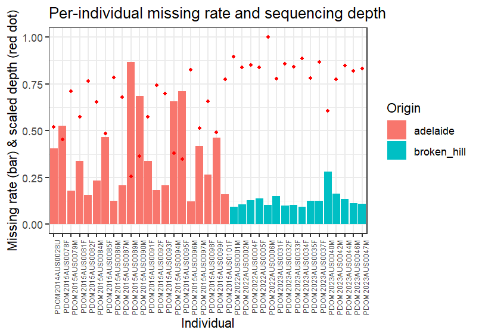
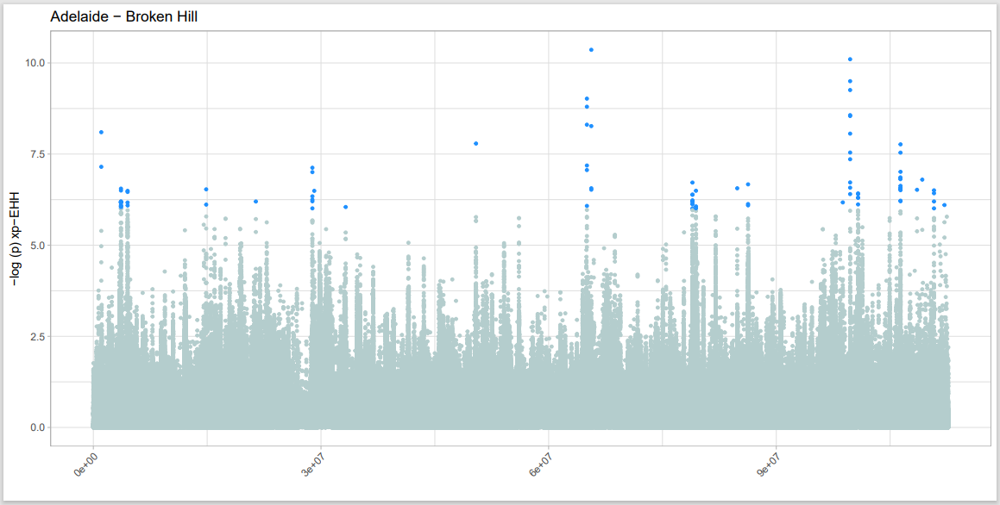

# reproduce_F
This is my workflow to reproduce Francesco's analysis.

## Mean depth and missing rates
My analysis used ```wholegenome_sparrows_variants_norm.vcf.gz```, which is generated by Francesco.
It's a variant only .vcf file of all the concatenated chromosomes (incl. sex chromosome Z) and scaffolds. 
It was normalized by the command ```bcftools norm```.

Missing rates for each individual were extracted with:

```
vcftools --gzvcf /cluster/work/users/ysun/HouseAusLead_filteredvcf/wholegenome_sparrows_variants_norm.vcf.gz \
  --missing-indv
```

which produced ```out.imiss```.

Mean depths for each individual were extracted with:

```
vcftools --gzvcf /cluster/work/users/ysun/HouseAusLead_filteredvcf/wholegenome_sparrows_variants_norm.vcf.gz \
  --depth --out depth.out
```

which produced ```depth.out.idepth```.

```out.imiss``` and ```depth.out.idepth``` were then downloaded and processed in RStudio using the R script ```missing_rate_plot.R```. 


## PCA
Work directory:

```
cd /cluster/work/users/ysun/PCA/
```

Load plink module for analysis:

```
module load PLINK/1.9b_6.13-x86_64
```

#### Linkage pruning
```
VCF=/cluster/work/users/ysun/HouseAusLead_filteredvcf/wholegenome_sparrows_variants_norm.vcf.gz

plink --vcf $VCF \
  --allow-extra-chr \
  --chr-set 30 \
  --double-id \
  --indep-pairwise 50 10 0.1 \
  --mind 0.99 \
  --out sparrows_ys \
  --set-missing-var-ids @:#
```

This produced ```sparrows_ys.prune.in``` and ```sparrows_ys.prune.out```.

#### Perform PCA
```
plink --vcf $VCF \
  --double-id \
  --allow-extra-chr \
  --set-missing-var-ids @:# \
  --extract sparrows_ys.prune.in \
  --make-bed \
  --pca \
  --out sparrows_ys \
  --chr-set 30 \
  --mind 0.99
```

This produced ```sparrows_ys.bed```, ```sparrows_ys.bim```, ```sparrows_ys.fam```, ```sparrows_ys.eigenval``` and ```sparrows_ys.eigenvec```.
```sparrows_ys.eigenval``` and ```sparrows_ys.eigenvec``` were then processed locally in RStudio using the script ```PCAafterPLINK_ys.R``` 
(metadata ```metadata.csv``` is needed). 

The eigenvalues are still different from Francesco's (I don't know why, maybe normal stochasticity?), but the final plot looks completely identical:

Francesco's:

My:


## Population tree
I followed Francesco's instructions in his email: 
"I first filtered the .vcf obtained in the first step file to include only the samples I was interested in, 
unzipped it and randomly subsampled it to include 1 million snps, zipped it again and indexed it, 
removed invariant sites, converted it to .phyl with the custom python script I uploaded 
and finally ran iqtree2 -st DNA -m GTR+ASC –threads-max 4 -B 1000 -s <data>. 
I used vcftools for everything and the scripts you find in the dropbox for the last two steps. " by:

```
# Get a list of wanted sample names (only Australian and New Caledonian)
bcftools query -l gs_wholegenome_sparrows_variants_norm.vcf.gz | grep -E "AUS|NCL" > keep_AUS_NCL.txt

# Filter the whole genome vcf according to the list
vcftools --gzvcf gs_wholegenome_sparrows_variants_norm.vcf.gz \
  --keep keep_AUS_NCL.txt \
  --recode --recode-INFO-all \
  --out filtered_AUS_NCL
# After filtering, kept 155 out of 219 Individuals.

# Randomly sample 1M SNPs from the generated vcf
grep -v "^#" filtered_AUS_NCL.recode.vcf | shuf -n 1000000 | sort -k1,1 -k2,2n > snp1M.body

# Add header
grep "^#" filtered_AUS_NCL.recode.vcf > header.txt
cat header.txt snp1M.body > snp1M.vcf

# Zip and index
bgzip snp1M.vcf
tabix -p vcf snp1M.vcf.gz

# Remove invariant sites
vcftools --gzvcf snp1M.vcf.gz \
  --remove-indels \
  --min-alleles 2 --max-alleles 2 \
  --recode --recode-INFO-all \
  --out snp1M_clean

# Apply the custom Python script
python vcf2phyl.py snp1M_clean.recode.vcf

# Run the iqtree code
iqtree2 -st DNA -m GTR+ASC --threads-max 4 -B 1000 -s snp1M_clean.recode.min4
```

Then I got this error:

```
ERROR: Invalid use of +ASC because of 159129 invariant sites in the alignment
```

But according to IQ-TREE's FAQ (https://iqtree.github.io/doc/Frequently-Asked-Questions), 
"Starting with IQ-TREE version 1.5.0, an output alignment file with suffix .varsites is written in such cases, which contain only variable sites from the input alignment. The .varsites alignment can then be used with the +ASC model."

So I ran:

```
iqtree2 -st DNA -m GTR+ASC --threads-max 4 -B 1000 -s snp1M_clean.recode.min4.phy.varsites.phy
```

Then I got another error:

```
WARNING: 38 sequences contain more than 50% gaps/ambiguity
****  TOTAL              32.27%  4 sequences failed composition chi2 test (p-value<5%; df=3)
WARNING: Sequence PDOM2015AUS0033F contains only gaps or missing data
ERROR: Some sequences (see above) are problematic, please check your alignment again
```

Sequence PDOM2015AUS0033F indeed contained only missing data. I checked her missing rate in ```snp1M_clean.recode.vcf```, 
and it was 0.999994, so after removing invariant sites, it was likely that only missing data were left for this sample.

So I manually removed this sample from ```snp1M_clean.recode.min4.phy.varsites.phy```, then the code ran successfully:

```
iqtree2 -st DNA -m GTR+ASC --threads-max 4 -B 1000 -s snp1M_clean.recode.min4.phy.varsites.copy.phy
```

```
Analysis results written to:
  IQ-TREE report:                snp1M_clean.recode.min4.phy.varsites.copy.phy.iqtree
  Maximum-likelihood tree:       snp1M_clean.recode.min4.phy.varsites.copy.phy.treefile
  Likelihood distances:          snp1M_clean.recode.min4.phy.varsites.copy.phy.mldist

Ultrafast bootstrap approximation results written to:
  Split support values:          snp1M_clean.recode.min4.phy.varsites.copy.phy.splits.nex
  Consensus tree:                snp1M_clean.recode.min4.phy.varsites.copy.phy.contree
  Screen log file:               snp1M_clean.recode.min4.phy.varsites.copy.phy.log
```

Then the treefile is downloaded to visualise in FigTree locally. 
However my tree is considerably different from Francesco's, although the overall conclusion is not affected.


## ADMIXTURE
I used the bim, fam and bed file from the PCA. Define input files and output directory:

```
FILE=/cluster/work/users/ysun/PCA/sparrows_ys
```

Load the ADMIXTURE module:

```
module load ADMIXTURE/1.3.0
```

I first renamed the chromosomes:

```
awk '{$1="0";print $0}' $FILE.bim > $FILE.bim.tmp
mv $FILE.bim.tmp $FILE.bim
```

Then loop from K=2 to K=7 (like Francesco did):

```
for i in {2..7}
do
 admixture --cv $FILE.bed $i > log${i}.out
done
```

This produced ```.out```, ```.P``` and ```.Q``` files for each K. 

Then, extract the number of K and the CV error for each corresponding K:

```
awk '/CV/ {print $3,$4}' *out | cut -c 4,7-20 > sparrows_ys.cv.error
```

I followed the code in the guideline to create a "species" list:

```
awk '{split($1,name,"."); print $1,name[2]}' $FILE.nosex > sparrows_ys.list
```

But in my case, it is population cluster instead of species and has to be assigned arbitrarily (three clusters based on the PCA result: 
"Europe", "north_cluster" and "south_cluster"). 
So I downloaded ```sparrows_ys.list``` and used R script ```plotADMIXTURE_ys.r``` to assign population cluster locally and got 
the output file ```sparrows_ys.info``` which can be used in the next step.

I downloaded all the P and Q files and ran this locally:

```
Rscript plotADMIXTURE.r -p sparrows_ys -i sparrows_ys.info -k 4 -l north_cluster,south_cluster,Europe
```

It still messed up like this:

Francesco's:

my:


However, it looked like it was still a plotting issue, so I wrote my own R script ```DiagnoseADMIXTURE.R``` just to diagnose. 
I only plotted K=2 and K=3, but they are more like Francesco's plot:


Some differences might be due to how the individuals were ordered.

I don't know why the data still messed up with Joana's R script...

## Detect selective sweep
For detecting selective sweep, I only used samples from one pair of sites: Broken Hill - Adelaide, to save time.

First, I used the R script ```GeneratePopInfo.R``` locally with ```metadata.csv``` to generate a list that only contained samples from Broken Hill 
and Adelaide.

The generated list ```pop.info``` was uploaded to HPC.

Then I subset the vcf.gz file to make one only contains Broken Hill and Adelaide individuals. First, create a list of sample names:

```
cut -f1 pop.info > sample_list.txt
```

Define the new VCF (not using ```wholegenome_sparrows_variants_norm.vcf.gz``` this time because I'm analysing the differentiation of the two populations), 
use the full vcf instead:

```
VCF=/cluster/work/users/ysun/HouseAusLead_filteredvcf/gs_wholegenome_sparrows_variants_norm.vcf.gz
```

Then extract the subset vcf:

```
# Load bcftools module
module load BCFtools/1.19-GCC-13.2.0

bcftools view -S sample_list.txt -Oz -o /cluster/work/users/ysun/BrokenHill_Adelaide/subset.vcf.gz $VCF
```

However, it gave me this error:

```
Error: subset called for sample that does not exist in header: "PDOM2015AUS0080F". Use "--force-samples" to ignore this error.
```

I ran following code to check which individuals were not in ```$VCF```:

```
bcftools query -l $VCF > vcf_samples.txt # Extract sample names from the vcf
comm -23 <(sort sample_list.txt) <(sort vcf_samples.txt) # Print individuals that are in the metadata but not in the vcf, which are:
PDOM2013AUS0029U
PDOM2013AUS0030U
PDOM2013AUS0031U
PDOM2013AUS0032U
PDOM2013AUS0033U
PDOM2013AUS0034U
PDOM2013AUS0035U
PDOM2013AUS0036U
PDOM2013AUS0037U
PDOM2014AUS0017U
PDOM2014AUS0023U
PDOM2014AUS0025U
PDOM2015AUS0080F
PDOM2015AUS0083M
PDOM2015AUS0088F
PDOM2015AUS0100F
PDOM2022AUS0003F
PDOM2023AUS0036F
PDOM2023AUS0038M
PDOM2023AUS0039M
PDOM2023AUS0041M
PDOM2023AUS0043M
PDOM2023AUS0045M
```

I don't know why they are not in the vcf, it may be about how the sequences were filtered? Anyway, I tried to get individuals that 
appeared in both the metadata and the vcf, by:

```
grep -Ff vcf_samples.txt pop.info > pop.valid.info # a filtered list with location info
cut -f1 pop.valid.info > sample.valid.txt # valid sample names
```

Then I ran this to subset the vcf:

```
VCFSUBSET=/cluster/work/users/ysun/BrokenHill_Adelaide/subset.vcf.gz
bcftools view -S sample.valid.txt -Oz -o $VCFSUBSET $VCF

# Index the vcf
bcftools index $VCFSUBSET
```

Visualise the sample quality:

```
# Missing rates
vcftools --gzvcf $VCFSUBSET \
  --missing-indv
  
# Mean depths
vcftools --gzvcf $VCFSUBSET \
  --depth
```

Use the R script ```missing_rate_plot.R``` locally again to produce the plot:



#### F<sub>ST</sub>
The subset vcf is ready, then I'm going to calculate F<sub>ST</sub> for the two populations. 

I first computed F<sub>ST</sub> following the how-to guide (https://speciationgenomics.github.io/sliding_windows/) 
using the GitHub repository https://github.com/simonhmartin/genomics_general.

Load Python module:

```
module load Python/3.11.3-GCCcore-12.3.0
```

Run:

```
python parseVCF.py -i $VCFSUBSET | bgzip > subset.geno.gz
```

Calculate pi for each species and Fst and dxy for each pair of species all in one go. 

```
GENOGENE=/cluster/work/users/ysun/genomics_general

python $GENOGENE/popgenWindows.py -g subset.geno.gz -o subset.Fst.Dxy.pi.csv.gz \
   -f phased -w 20000 -m 10000 -s 10000 \
   -p adelaide -p broken_hill \
   --popsFile pop.valid.info \
   --verbose
```

In Francesco's thesis: "The calculation was done on sliding windows of 20000 kb, with a step size of 10000 kb". 
But I keep getting this:

```
...
Slice 104672 sent to writer
Writer received result 104672
Sorter received window 104673
Slice 104673 sent to writer
Writer received result 104673
Sorter received window 104674

Waiting for all threads to finish
Slice 104674 sent to writer
Writer received result 104674
104675 windows were tested.
0 results were written.

Done.
```

Then I followed Mark's suggestion, lowering -m to ```5```:

```
python $GENOGENE/popgenWindows.py -g subset.geno.gz -o subset.Fst.Dxy.pi.csv.gz \
   -f phased -w 20000 -m 5 -s 10000 \
   -p adelaide -p broken_hill \
   --popsFile pop.valid.info \
   --verbose
```

This successfully produced output. I downloaded it (```subset.Fst.Dxy.pi.csv.gz```) and processed it in RStudio. 

Francesco's dataset had 104984 observations from 31 chromosomes + scaffolds; my dataset has 104371 observations from 31 chromosomes + scaffolds.

Negative F<sub>ST</sub> accounted for 30.5% in Francesco's dataset, and 33.2% in my dataset.

After removing scaffolds, 98506 observations from Francesco's dataset, 30.4% negative values; 98480 observations from my dataset, 32.2% negative values.

After removing negative values, genome-wide F<sub>ST</sub> was 0.024 for Francesco's dataset, 0.012 for mine. (0.024 was what I got running his code, 
but he reported 0.014 in his thesis. But in his figure, it looked more like 0.024.)

His plot:


My plot:


Hmm, I don't know how similar I could call this. But then I used vcftools, with code:

```
vcftools --gzvcf $VCFSUBSET \
  --weir-fst-pop Adelaide \
  --weir-fst-pop BrokenHill \
  --fst-window-size 20000 \
  --fst-window-step 10000 \
  --out Adelaide_BrokenHill
```

and this produced identical result to Francesco's.

#### Tajima's D
```
vcftools --gzvcf $VCFSUBSET \
  --TajimaD 10000 \
  --keep SampleList_BrokenHill \
  --out BrokenHill
```

This also produced identical results to Francesco's.


#### π<sub>polluted</sub>/π<sub>control</sub>

Mark and I decided to substitute Tajima's D with π<sub>polluted</sub>/π<sub>control</sub> because the latter controls for background selection and 
mutation rate. I use a 20000 window with a 10000 step to keep it consistent with the F<sub>ST</sub> analysis.

```
VCFSUBSET=/cluster/work/users/ysun/BrokenHill_Adelaide/subset.vcf.gz
cd /cluster/work/users/ysun/pi_ratio

# For Broken Hill:
vcftools --gzvcf $VCFSUBSET \
  --keep BrokenHill \
  --window-pi 20000 \
  --window-pi-step 10000 \
  --out pi_BrokenHill
  
# For Adelaide:
vcftools --gzvcf $VCFSUBSET \
  --keep Adelaide \
  --window-pi 20000 \
  --window-pi-step 10000 \
  --out pi_Adelaide
```


#### xpEHH

I used the repository https://github.com/markravinet/phasing_pipeline for phasing.

Load miniconda and mamba:

```
module load Miniconda3/23.10.0-1
module load Mamba/23.11.0-0
```

Activate the pre-built environment for phasing:

```
conda activate /cluster/projects/nn10082k/conda_group/phase
```

Run the code:

```
nextflow run phasing.nf \
  --vcf '/cluster/work/users/ysun/BrokenHill_Adelaide/subset.vcf.gz' \
  --windows 'house_genome_windows'
```

```house_genome_windows``` is a file copied from ```/cluster/projects/nn10082k/ref```. But this code ended up with:

```
Completed at: 07-Aug-2025 04:58:19
Duration    : 1h 32m 11s
CPU hours   : 0.9 (100% failed)
Succeeded   : 0
Ignored     : 12'414
Failed      : 12'414

WARN: Can't read history file: .nextflow/history
WARN: Can't read history file: .nextflow/history
```

The log file is uploaded as `.nextflow.log`.

Now I'm trying the new pipeline: https://github.com/EcoEvoGenomics/genotyping_pipeline. 
Under `/cluster/work/users/ysun/genotyping_pipeline`, I created the path `/output/03-variants_filtered/francesco` 
and copied `wholegenome_sparrows_variants_norm.vcf.gz` (normalised variant only vcf) and `wholegenome_sparrows_variants_norm.vcf.gz.csi` into it. 
Then I renamed them `variants_francesco.vcf.gz` and `variants_francesco.vcf.gz.csi`, respectively.

Then I ran:

```
sbatch genotyping_pipeline.slurm.sh
```

under the path `/cluster/work/users/ysun/genotyping_pipeline`, with a phasing window size of 10000000. 
This produced phased bcfs, vcf.gz's and indexes for each chromosome. 

I have the sample name list `Adelaide` and `BrokenHill`. I ran this to subset them from the whole vcf.gz:

```
# Define input and output directory
input_dir="/cluster/work/users/ysun/genotyping_pipeline/output/03-variants_filtered/francesco/phased"
output_dir="/cluster/work/users/ysun/xpEHH/Adelaide"
sample_file="/cluster/work/users/ysun/FST/Adelaide"

# Loop all the vcf.gz's
for vcf in ${input_dir}/*/*.vcf.gz; do
    # Extract filenames (without path)
    fname=$(basename "$vcf")
    
    # Output path
    out_vcf="${output_dir}/Adelaide_${fname}"
    
    echo "Processing $fname ..."
    
    bcftools view -S "$sample_file" \
        -O z \
        -o "$out_vcf" \
        "$vcf" \
        --force-samples && \
    bcftools index "$out_vcf"
done
```

Run the same for the Broken Hill samples:

```
# Define input and output directory
input_dir="/cluster/work/users/ysun/genotyping_pipeline/output/03-variants_filtered/francesco/phased"
output_dir="/cluster/work/users/ysun/xpEHH/BrokenHill"
sample_file="/cluster/work/users/ysun/FST/BrokenHill"

# Loop all the vcf.gz's
for vcf in ${input_dir}/*/*.vcf.gz; do
    # Extract filenames (without path)
    fname=$(basename "$vcf")
    
    # Output path
    out_vcf="${output_dir}/BrokenHill_${fname}"
    
    echo "Processing $fname ..."
    
    bcftools view -S "$sample_file" \
        -O z \
        -o "$out_vcf" \
        "$vcf" \
        --force-samples && \
    bcftools index "$out_vcf"
done
```

Output vcf.gz's were downloaded and run in RStudio using the script `xpEHH.R`.

The result was not much alike:

Mine:


Francesco's (it should be a mistake on the y-axis -- it should be negative log p-value, not xpEHH.):


I doubt that we diverged from phasing, as I used the variant-only vcf while he used the full dataset. 
His xpehh data ended up much much larger than mine. (For example for chr1A, his xpehh had 1580443 observations while mine only had 2817.) 
(and I don't have mtDNA.) However, I checked the positions of the outlier sites, and none of them was the same. 
Outliers were saved in `outliers.csv` (mine) and `outliers_F.csv` (Francesco's) respectively.

To diagnose, I used the same input (`gs_wholegenome_sparrows_variants_norm.vcf.gz`) as Francesco did, and renamed them 
"variants_full_data_ver.vcf.gz" and "variants_full_data_ver.vcf.gz.csi" under the path 
`/cluster/work/users/ysun/genotyping_pipeline/output/03-variants_filtered/full_data_ver`, and changed `filtering_label` to `"full_data_ver"` 
in `genotyping_pipeline.slurm.sh`.

Then I ran:

```
sbatch genotyping_pipeline.slurm.sh
```

under the path `/cluster/work/users/ysun/genotyping_pipeline`, with a phasing window size of 10000000. 
This produced phased bcfs, vcf.gz's and indexes for each chromosome under the path 
`/cluster/work/users/ysun/genotyping_pipeline/output/03-variants_filtered/full_data_ver/phased`. 
Then I repeated the process:

I have the sample name list `Adelaide` and `BrokenHill`. I ran this to subset them from the whole vcf.gz:

```
# Define input and output directory
input_dir="/cluster/work/users/ysun/genotyping_pipeline/output/03-variants_filtered/full_data_ver/phased"
output_dir="/cluster/work/users/ysun/xpEHH/Adelaide_full"
sample_file="/cluster/work/users/ysun/FST/Adelaide"

# Loop all the vcf.gz's
for vcf in ${input_dir}/*/*.vcf.gz; do
    # Extract filenames (without path)
    fname=$(basename "$vcf")
    
    # Output path
    out_vcf="${output_dir}/Adelaide_${fname}"
    
    echo "Processing $fname ..."
    
    bcftools view -S "$sample_file" \
        -O z \
        -o "$out_vcf" \
        "$vcf" \
        --force-samples && \
    bcftools index "$out_vcf"
done
```

It gave me warnings:

```
Warn: subset called for sample that does not exist in header: "PDOM2015AUS0080F"... skipping
Warn: subset called for sample that does not exist in header: "PDOM2015AUS0083M"... skipping
Warn: subset called for sample that does not exist in header: "PDOM2015AUS0088F"... skipping
Warn: subset called for sample that does not exist in header: "PDOM2015AUS0100F"... skipping
Warn: subset called for sample that does not exist in header: "PDOM2013AUS0031U"... skipping
Warn: subset called for sample that does not exist in header: "PDOM2013AUS0037U"... skipping
Warn: subset called for sample that does not exist in header: "PDOM2014AUS0017U"... skipping
Warn: subset called for sample that does not exist in header: "PDOM2014AUS0023U"... skipping
Warn: subset called for sample that does not exist in header: "PDOM2014AUS0025U"... skipping
```

I don't remember if I had this before, so I ran the following line to check what samples 
```/cluster/work/users/ysun/genotyping_pipeline/output/03-variants_filtered/full_data_ver/phased/chr1/chr1.vcf.gz``` 
contains:

```
bcftools query -l /cluster/work/users/ysun/xpEHH/Adelaide_full/Adelaide_chr1.vcf.gz \
> /cluster/work/users/ysun/xpEHH/Adelaide_full/FullDataSamples
```

Run the same for the old phased vcf.gz:

```
bcftools query -l /cluster/work/users/ysun/xpEHH/Adelaide/Adelaide_chr1.vcf.gz \
> /cluster/work/users/ysun/xpEHH/Adelaide/samples
```

The two files are the same so no problem.

Run the same for the Broken Hill samples:

```
# Define input and output directory
input_dir="/cluster/work/users/ysun/genotyping_pipeline/output/03-variants_filtered/full_data_ver/phased"
output_dir="/cluster/work/users/ysun/xpEHH/BrokenHill_full"
sample_file="/cluster/work/users/ysun/FST/BrokenHill"

# Loop all the vcf.gz's
for vcf in ${input_dir}/*/*.vcf.gz; do
    # Extract filenames (without path)
    fname=$(basename "$vcf")
    
    # Output path
    out_vcf="${output_dir}/BrokenHill_${fname}"
    
    echo "Processing $fname ..."
    
    bcftools view -S "$sample_file" \
        -O z \
        -o "$out_vcf" \
        "$vcf" \
        --force-samples && \
    bcftools index "$out_vcf"
done
```

Just to make sure if the samples are right:

```
bcftools query -l /cluster/work/users/ysun/xpEHH/BrokenHill/BrokenHill_chr1.vcf.gz \
> /cluster/work/users/ysun/xpEHH/BrokenHill/samples

bcftools query -l /cluster/work/users/ysun/xpEHH/BrokenHill_full/BrokenHill_chr1.vcf.gz \
> /cluster/work/users/ysun/xpEHH/BrokenHill_full/FullDataSamples
```

No problem.

Output vcf.gz's were downloaded and run in RStudio using the script `xpEHH.R`. The process took long locally so I consider running it on HPC for 
the formal analysis. Chr1 had 1580835 observations, which differed from 1580443 in Francesco's original analysis, but not a lot! 

Francesco's chr1 had 93 outliers, and mine had 103. They are similar although not the same:

Mine:


Francesco's:



## Identify and cluster outliers

I used the R script `id_and_cluster_outliers_fst.R` to identify and cluster F<sub>ST</sub> outliers. 
The F<sub>ST</sub> was originally calculated in 20000 bp bins. If the distance between the middle points of two ourlier bins wasn't larger than 
100000, they are combined into one cluster. In this way, 576 outlier clusters were identified. The result is saved as 
`adelaide_brokenhill_top2,5%fst_nochrZ_clusters_20kb.csv`.

For Tajima's D, the R script `id_and_cluster_outlier_tajd.R` works in the same way, just that the Tajima's D was calculated with 10000 bp bins. 
The result was saved as `brokenhill_tajimad_bottom2,5%_clusters.csv`.

Then, for xpEHH, I used Francesco's output for now just to reproduce. Each xpEHH value corresponds to a cumulative position, 
and they are also clustered with the 100000 pb threshold. I don't understand why this code exists (in the R script 
`identify_and_cluster_outliers.R`):

```
# Adjust the start and stop positions
myCluster <- myCluster %>%
  mutate(start = start - 125000,
         stop = stop + 125000)
```

but I leave it for now. The result was saved as `adelaide_bhill_xpehh_nochrZ_clusters_+-125k.csv`.

## Identify genes

The R script `identify_genes_clusters.R` maps the outlier regions from the previous step to a .gff file. 
It outputs gene lists `adelaide_brokenhill_top2,5%_fst_genes.list` (for F<sub>ST</sub>), `brokenhill_top2,5%_tajd_genes.list` 
(for Tajima's D), and `XonlyID_xpehh_nochrZ_adelaide_bhill.list`(for xpEHH).

Using the R command `intersect()`, 1 gene was identified by all the three metrics. It's IV00_00047272. Note in the gff is "Similar to Cuedc1: CUE domain-containing protein 1 (Mus musculus)". 
I searched on NCBI to find out Cuedc1 is a gene related to **protein binding** and **ubiquitin binding**.